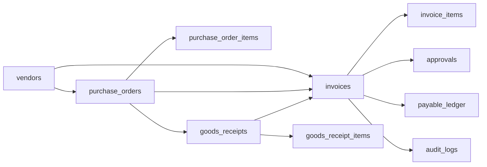

# Database schema overview

## Relationship summary

- A vendor can have many purchase orders and invoices.
- A purchase order can have multiple line items and may produce one or many goods receipts.
- A goods receipt references a PO and records the received quantity.
- An invoice references a vendor and may optionally reference a PO.
- An invoice can have multiple invoice line items and approval records.
- A payable ledger record is created only for validated and approved invoices.
- Audit logs record significant AP actions and exceptions.
